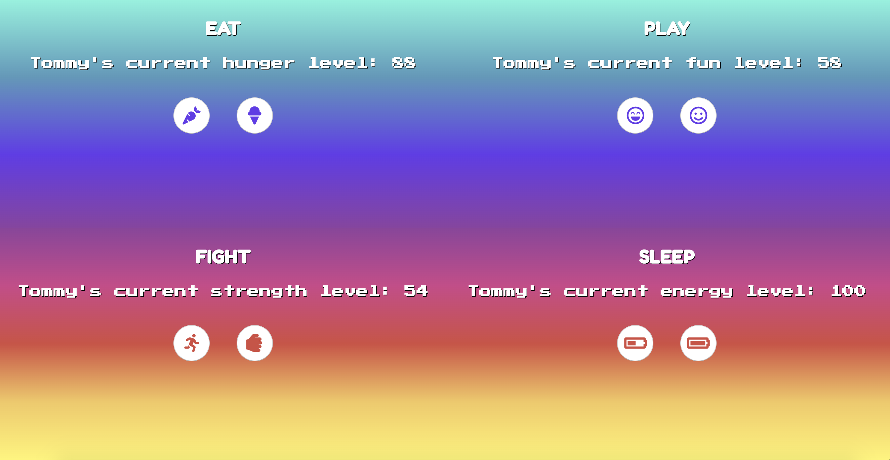

# Tamagotchi Exercise

## Description
This is a homework assignment to practice using JS modules and SASS styling.

### Feature List
* Displays four quadrants for the tamagotchi pet's various status levels for hunger, fun, fighting, and sleeping.
* Each quadrant has buttons that, when clicked, affect the status level for that quadrant by a certain value.
* The values do not go above 100 nor below 0.
* Responsive design

### How To Run
1. Clone the repo to have it on your local machine along with all of the webpack components
1. Use `npm start` to start up a local server
1. Visit the server in your browser (defaults to localhost:8080)

### Screenshots

### Contributors
* [Jeanine Beckle](https://github.com/jeaninebeckle)

### TODO
* Refactor code so that functions are more reusable between modules
